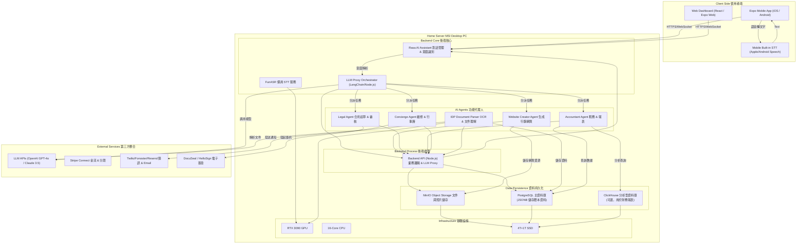
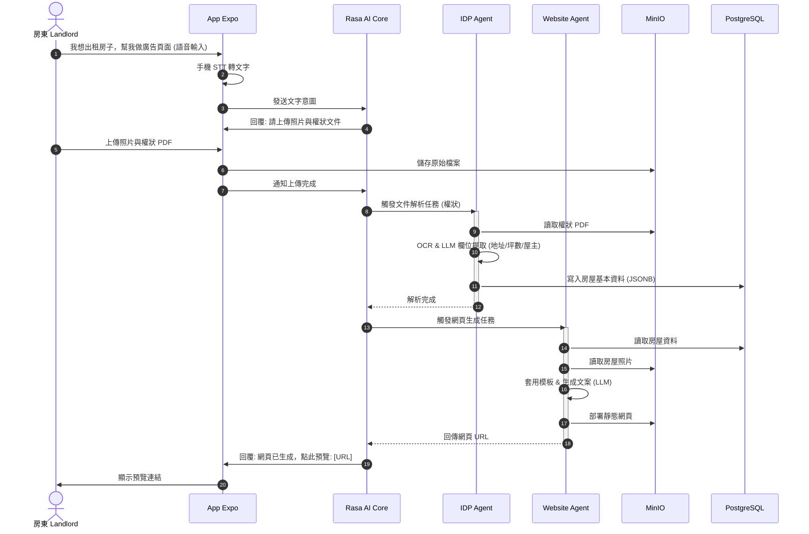
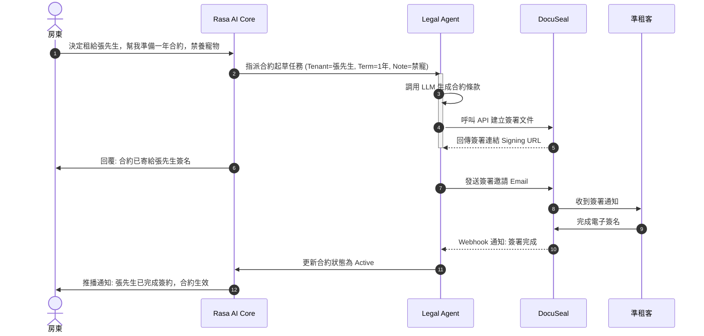
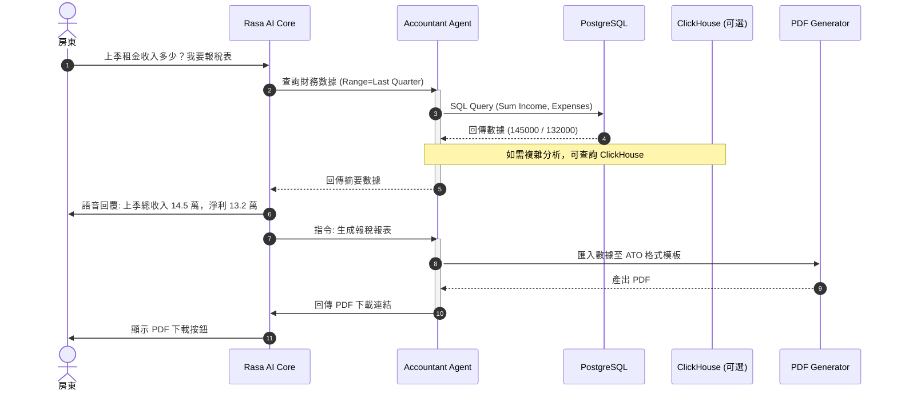

# 軟硬體開發架構與互動流程圖

本文件描述「房東物件管理語音 AI App」的系統架構與使用者互動流程。

## 1. 系統架構圖 (System Architecture)

此圖表展示了地端硬體設施 (Home Server) 與雲端服務、使用者端應用程式之間的關係。

---

## 2. 核心互動流程 (Core Interaction Flow)

以下流程圖展示房東透過語音指令，驅動 AI 助理完成「物件上架」與「合約製作」的過程。

### 2.1 場景一：物件上架與網頁生成 (Listing Creation)

### 2.2 場景二：租客篩選與電子簽約 (Screening & Leasing)

### 2.3 場景三：財務報表查詢 (Financial Reporting)

## 3. 架構說明

### 3.1 資料庫選擇

- **PostgreSQL (主資料庫)**：
  - 儲存謄本 PDF 解析後的 JSON 資料（使用 JSONB 類型）
  - 物件基本資料、租賃合約、租客資料、財務記錄等
  - 支援關聯查詢、ACID 事務、單筆物件查詢效能佳

- **ClickHouse (分析型資料庫，可選)**：
  - 僅用於大規模分析型查詢
  - 財務報表統計、跨物件數據聚合查詢
  - 不建議用於日常的物件資料儲存與查詢

### 3.2 後端架構

- **Backend API (Node.js)**：
  - 使用 Node.js + Express/Fastify + LangChain
  - 處理業務邏輯、LLM Proxy Orchestrator
  - 與 AI Agents 整合、資料庫操作、檔案管理

- **Rasa (Python)**：
  - AI 語音助手框架
  - 對話管理與意圖識別
  - 通過 HTTP API 與 Node.js 後端通信

### 3.3 前端架構

- **Expo**：
  - 移動端應用（iOS/Android）
  - Web Dashboard（Expo Web）
  - 通過 HTTPS/WebSocket 與後端通信
