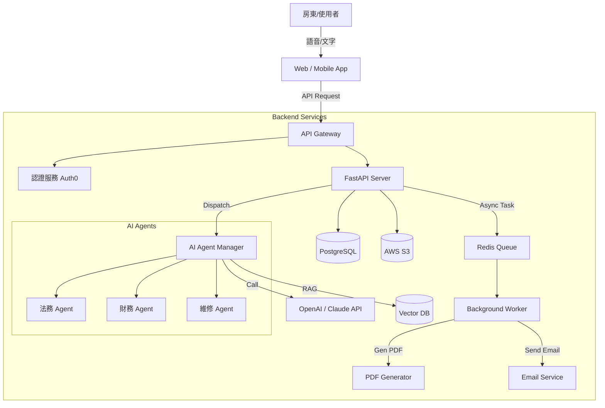

# 專案架構建議書 (Project Architecture Proposal)

## 1. 專案背景與目標
本專案旨在開發一款「房東物件管理語音 AI App」，透過自然語言對話（語音/文字）協助房東處理從招租、篩選租客、簽約、維修到財務報表的一站式管理。核心競爭力在於高度自動化的 AI 助理與文件生成能力。

## 2. 技術堆疊 (Tech Stack)

考慮到 AI 整合的深度以及對即時語音互動的需求，本專案前後端採用 React Native Expo AI語音用

### 2.1 前端 (Frontend)
*   **Web (房東管理後台 & Landing Page):**
    *   **Framework:** **Next.js (React)** - 具備優秀的 SEO 能力（針對 Landing Page）與 Server-Side Rendering (SSR) 效能。
    *   **UI Library:** **Tailwind CSS** + **Shadcn/ui** - 快速建構現代化、響應式的介面。
    *   **State Management:** **Zustand** 或 **React Query** (TanStack Query) - 處理伺服器狀態同步。
*   **Mobile App (iOS / Android):**
    *   **Framework:** **React Native (Expo)** - 共用 React 邏輯，快速開發雙平台原生 App，並能良好支援麥克風與語音功能。

### 2.2 後端 (Backend)
*   **API Framework:** **FastAPI (Python)**
    *   **理由:** Python 是 AI 生態系的首選語言。FastAPI 支援非同步 (Async) 處理，能高效處理大量並發的 WebSocket 連線（用於即時語音對話）與 API 請求。
*   **Database (Relational):** **PostgreSQL**
    *   **用途:** 儲存使用者資料、物業資訊、租約條款、財務流水帳等結構化資料。建議使用 **Supabase** 或 **AWS RDS** 託管。
*   **Vector Database (AI Memory):** **Pinecone** 或 **Qdrant**
    *   **用途:** 實作 RAG (Retrieval-Augmented Generation)。儲存租賃法規文件、過往維修紀錄、房屋文件內容，讓 AI 能根據具體脈絡回答問題（例如：「上次修熱水器是多少錢？」）。
*   **Object Storage:** **AWS S3** 或 **Google Cloud Storage**
    *   **用途:** 儲存房東上傳的大量照片、影片 (Condition Reports) 與生成的 PDF 文件。

### 2.3 AI 核心服務 (AI Core)
*   **LLM (大語言模型):** **OpenAI GPT-4o** 或 **Anthropic Claude 3.5 Sonnet**
    *   負責理解意圖、生成文案、撰寫合約條款、分析財務數據。
*   **Speech-to-Text (STT):** **OpenAI Whisper**
    *   將房東的語音指令精準轉為文字。
*   **Text-to-Speech (TTS):** **ElevenLabs** 或 **OpenAI TTS**
    *   提供自然、擬真的 AI 語音回覆。
*   **Orchestration:** **LangChain** 或 **LangGraph**
    *   管理對話流程，串接不同工具（如：查詢資料庫、發送 Email、生成 PDF）。

## 3. 創新專案架構建議 (Innovative Architecture)

為了在市場上脫穎而出，建議採用以下創新架構模式：

### 3.1 多代理人協作系統 (Multi-Agent Swarm Architecture)
不要只建立一個「萬能助理」，而是構建一個**專家代理人團隊**。主控 AI (Dispatcher) 根據使用者意圖，將任務指派給專門的 Sub-Agents：
*   **Legal Agent (法務代理人):** 專精於租賃法規，負責起草合約、審核條款。
*   **Accountant Agent (會計代理人):** 專精於稅務與財務，負責生成 ATO 報表、計算投報率。
*   **Concierge Agent (管家代理人):** 負責聯繫維修師傅、安排看房行事曆。
*   **優勢:** 提高回答的專業度與準確性，便於個別模組的維護與升級。

### 3.2 事件驅動與非同步處理 (Event-Driven Async Processing)
針對耗時任務（如：生成 4K 影片導覽、分析 50 頁的租約文件），不應讓使用者在對話框乾等。
*   **Message Queue:** 使用 **Redis** 或 **RabbitMQ**。
*   **流程:** 房東說「幫我生成報表」 -> AI 回覆「好的，處理中，完成後通知您」 -> 背景 Worker 執行任務 -> 完成後透過 **WebSocket** 推送通知給前端。

### 3.3 邊緣 AI (Edge AI) 與隱私優先
考慮到房東可能談論敏感財務資訊，可在 App 端整合輕量級模型（如 Gemini Nano 或 Whisper Tiny）。
*   **功能:** 在手機端直接進行喚醒詞偵測與初步語音轉文字，減少雲端 API 呼叫成本，並提升隱私安全性。

### 3.4 智慧文件理解 (Intelligent Document Processing, IDP)
針對「文件小幫手」功能，建立專屬的 Document Parsing Pipeline。
*   當使用者上傳權狀或舊合約時，系統自動透過 **OCR (AWS Textract)** + **LLM** 提取關鍵欄位（地址、坪數、到期日）並自動填入資料庫，減少人工輸入。

## 4. 系統架構圖 (Conceptual Diagram)

## 5. 下一步建議
1.  **Prototype 開發:** 優先實作「語音對話介面」與「簡易房源上傳」功能，驗證 AI 對話流暢度。
2.  **資料庫設計:** 規劃完整的 Schema，特別是針對 Property 與 Lease 的關聯。
3.  **Template 引擎:** 完善靜態網頁生成器 (Static Site Generator)，讓房東能一鍵部署銷售頁面。
